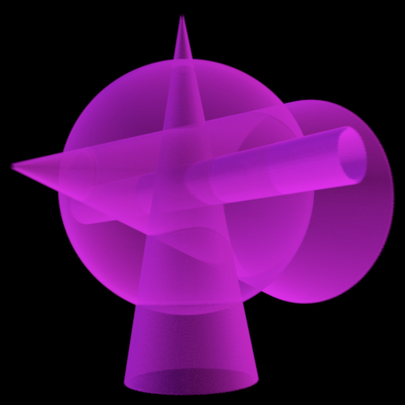
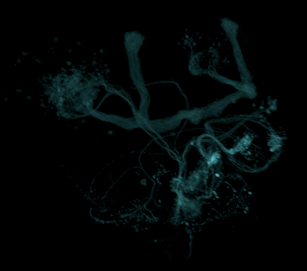

[](https://zenodo.org/doi/10.5281/zenodo.6772505)

# web-h5j-loader

## Summary

This module provides JavaScript functions to load data from files in [H5J format](https://github.com/JaneliaSciComp/workstation/blob/master/docs/H5JFileFormat.md).  A H5J file is an [HDF5 container](https://www.hdfgroup.org/solutions/hdf5/) with one or more channels of 3D volumetric data with 12-bit values compressed using [H.265 (a.k.a. HEVC or High Efficiency Video Coding)](https://en.wikipedia.org/wiki/High_Efficiency_Video_Coding).  H5J is a "visually lossless" format useful for fluorescence microscopy data.

The HDF5 container is read with the [`jsfive` module](https://www.npmjs.com/package/jsfive).  The H.265 data is decoded with the [`ffmpeg.wasm` module](https://github.com/ffmpegwasm/ffmpeg.wasm), which uses [WebAssembly (wasm)](https://webassembly.org).  The `ffmpeg.wasm` module was built using [Emscripten](https://emscripten.org), to transpile the original [FFmpeg](https://ffmpeg.org) C++ code into WebAssembly.

## Usage

First, install the [NPM module](https://www.npmjs.com/package/@janelia/web-h5j-loader):
```
npm install @janelia/web-h5j-loader
```
Then, the following code loads an H5J file from a URL and decompresses one channel of data into 8-bit values in a [`Uint8Array`](https://developer.mozilla.org/en-US/docs/Web/JavaScript/Reference/Global_Objects/Uint8Array):
```javascript
import { openH5J, getH5JAttrs, readH5JChannelUint8 } from '@janelia/web-h5j-loader';
try {
  const fileH5J = await openH5J('http://example.org/example.h5j');
  const attrs = getH5JAttrs(fileH5J);
  const dataUint8 = await readH5JChannelUint8(attrs.channels.names[0], fileH5J);
  ...
} catch (e) {
    console.log(e.message);
}
```
Reading the original 12-bit values into an 8-bit array in this manner sacrifies some accuracy ([see below](#accuracy)), but is useful for some applications like high-performance direct volume rendering.

As an alternative, the original 12-bit values can be read into a 16-bit [`Uint16Array`](https://developer.mozilla.org/en-US/docs/Web/JavaScript/Reference/Global_Objects/Uint16Array) as shown in this next example.  This example also shows loading the H5J from a file on the local host, in the `onChange` callback for an `<input type="file" />` element:
```javascript
import { openH5J, getH5JAttrs, readH5JChannelUint16 } from '@janelia/web-h5j-loader';
const onChange = async (event) => {
  try {
      const fileH5J = await openH5J(event.target.files[0]);
      const attrs = getH5JAttrs(fileH5J);
      const dataUint16 = await readH5JChannelUint16(attrs.channels.names[0], fileH5J);
      ...
    } catch (e) {
      console.log(e.message);
    }
}  
```

## Cross-Origin Isolation

If run with a basic server, the example code above will produce an exception:
```
SharedArrayBuffer is not defined
```
The problem is that `ffmpeg.wasm` uses multiple threads to improve performance, and these threads require a [`SharedArrayBuffer`](https://developer.mozilla.org/en-US/docs/Web/JavaScript/Reference/Global_Objects/SharedArrayBuffer) to implement shared memory.  Due to [security risks](https://developer.mozilla.org/en-US/docs/Web/JavaScript/Reference/Global_Objects/SharedArrayBuffer#security_requirements), `SharedArrayBuffer` is disabled in most browsers unless it is used with [cross-origin isolation](https://web.dev/cross-origin-isolation-guide).  To enable cross-origin isolation, a site must be served with two additional headers:
```
Cross-Origin-Opener-Policy: same-origin
Cross-Origin-Embedder-Policy: require-corp
```
For a site created with [`create-react-app`](https://create-react-app.dev/), a way to add these headers to the development server is to use the [CRACO (Create React App Configuration Override) package](https://github.com/gsoft-inc/craco).  
1. Install CRACO:
    ```
    npm install @craco/craco --save
    ```
    (With newer versions of NPM, it may be necessary to append the [` --legacy-peer-deps` argument](https://stackoverflow.com/questions/66239691/what-does-npm-install-legacy-peer-deps-do-exactly-when-is-it-recommended-wh) to the end of the previous installation line.)
2. Add a `craco.config.js` file (as a sibling to the site's `package.json` file) with the following contents:
    ```
    module.exports = {
      devServer: {
        headers: {
          'Cross-Origin-Embedder-Policy': 'require-corp',
          'Cross-Origin-Opener-Policy': 'same-origin'
        },
      },
    };
    ```
3. Then change the `react-scripts` to `craco` in most entries of the `scripts` section of the site's `package.json` file:
    ```
    ...
    "scripts": {
      "start": "craco start",
      "build": "craco build",
      "test": "craco test",
      "eject": "react-scripts eject"
    },
    ...
    ```

## Testing

The tests for `web-h5j-loader` use the [Jest](https://jestjs.io) framework, and can be run from the command line as follows:
```
npm run test
```
The final two tests in the `web-h5j-loader.test.js` file load a special data set, `testData/h64w64d4096_uint16_0-4095.h5j`, containing all possible 12-bit data values.  These tests verify how this data is convereted to 8-bit values (`Uint8Array`) and 16-bit values (`Uint16Array`).

## Accuracy

The special data set, `testData/h64w64d4096_uint16_0-4095.h5j`, consists of slices (of width 64 and height 64) with a constant 12-bit data value.  There are $2^{12} = 4096$ such slices, with slice $d$ (from 0 to 4095) having data value $d$.  Thus, this data set shows how each possible 12-bit data value is transformed by compression.

When this data set is loaded into a `Uint8Array` by `readH5JChannelUint8()`, the expected behavior would be that 16 12-bit values would be mapped to the same 8-bit value.  For slice $d$, the expected 8-bit value would be the rounded value $v = \lfloor d / 16 + 0.5 \rfloor$.  In practice, there is a little variation within each slice, with both $v$ and $v+1$ occurring.  The mode (i.e., value occurring most frequently within the slice) is $v$, as expected, for most slices.  The exceptions are slices with $d \mod 16 = 8$, where the mode is $v+1$, and $d \mod 16 = 9$, where the mode may be $v$ or $v+1$.

When `testData/h64w64d4096_uint16_0-4095.h5j` is loaded into a `Uint16Array` by `readH5JChannelUint16()`, each 12-bit value is preseved, as expected.  For slice $d$, there is some variation in values, from $d-3$ to $d+2$.  There is somewhat less variation in the mode, having values from $d-1$ to $d+1$.

## Test data

The `testData` subdirectory contains various data sets for testing.  One is the `h64w64d4096_uint16_0-4095.h5j` data set mentioned above, for accuracy testing.

Another has a sphere at the origin, a fat cone pointing along the positive $x$ axis, a thin cone pointing along the positive $y$ axis, and a cylinder along the $z$ axis.  When loaded into a `Uint8Array`, the data value for the sphere is 64, for the fat cone is 96, for the thin cone is 128, and for the cylinder is 160.  There are several copies of the data set at different resolutions:
* Low resolution (64 x 64 x 64): `sphere64cone96cone128cylinder160_w64h64d64th3.h5j`
* Medium resolution (256 x 256 x 256):
`sphere64cone96cone128cylinder160_w256h256d256th3.h5j`
* High resolution (512 x 512 x 512):
`sphere64cone96cone128cylinder160_w512h512d512th3.h5j`
* Non-cubical (256 x 128 x 64): `sphere64cone96cone128cylinder160_w256h128d64th3.h5j`

<p align="center">

</p>

The Python script `makeTestStack.py` generates the TIFF stack that is the original data represented in these `sphere64cone96cone128cylinder160...h5j` files.  See the next section for more about creating H5J files.

The final data set is and real fluorescence microscopy volume from 
 the [FlyLight Generation 1 MCFO collection](https://gen1mcfo.janelia.org/cgi-bin/gen1mcfo.cgi) (citation: https://dx.doi.org/10.1016/j.celrep.2012.09.011):

`R10E08-20191011_61_I8-m-40x-central-GAL4-JRC2018_Unisex_20x_HR-aligned_stack.h5j` 
<p align="center">

</p>

It has resolution 1210 x 566 x 174.

## Making H5J files

The easiest way to make a H5J file is to convert a [TIFF](https://en.wikipedia.org/wiki/TIFF) stack, a multi-frame (multi-page) TIFF image where each frame represents a step in depth.  To convert the TIFF stack `/tmp/example.tif`, use Docker as follows:
```
docker run -v /tmp:/data janeliascicomp/flylight_tools:1.1.0 /app/scripts/cmd/convert.sh /data/example.tif /data/example.h5j /data/example.yml 0 1

docker run -v /tmp:/data janeliascicomp/flylight_tools:1.1.0 /app/scripts/cmd/h5jMetadata.sh /data/example.h5j /data/example.yml
```

The `/tmp/example.yml` file should have a format like the following (perhaps with more than just the one `Channel_0`):
```
attrs:
  image_size: [256.0, 128.0, 64.0]
  voxel_size: [1.0, 1.0, 1.0]
  channel_spec: r
groups:
  Channels:
    attrs:
      frames: [64]
      height: [128]
      pad_bottom: [0]
      pad_right: [0]
      width: [256]
    groups:
      Channel_0:
        attrs: {content_type: reference}
```
